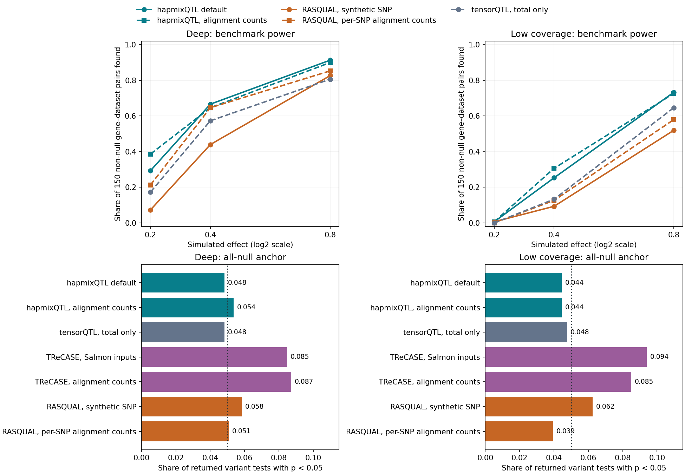

> **Draft status.** This manuscript describes the implemented method and completed pilot benchmarks. Results from an observed-data association scan using the final configuration and from held-out replication remain pending. Bracketed statements identify material still needed for submission. Numerical provenance is recorded in the companion `evidence.tsv`; the evaluated code state is `874e10a`. This draft does not constitute a completed biological discovery study.

## Abstract

Haplotype-resolved RNA sequencing can improve cis-eQTL mapping by combining total expression across individuals with allelic expression within individuals. However, ambiguity in assigning RNA reads to transcripts and haplotypes creates unequal quantification uncertainty across donor–gene pairs. We introduce hapmixQTL, an extension of the two-channel regression approach that uses Salmon inferential samples to weight allelic expression while fitting residual variance separately in each channel. The method combines a weighted log2 allelic contrast with an unweighted, half-read-offset log2 total-expression phenotype and uses donor-record permutations for gene-level inference. We evaluated the implemented configuration in two 100-gene sets from 92 donors, spanning different haplotype-read coverage distributions. On all-null simulated datasets, the ratio of combined squared error to an otherwise identical unweighted estimator was 0.84 (95% gene-bootstrap interval, 0.79–0.89) in the deep set and 0.90 (0.87–0.93) in the low-coverage set. At a simulated log2 allelic effect of 0.8, mean effect-size recovery was 0.986 and 0.943, respectively. In a matched 52-variant-per-gene comparison, hapmixQTL and native-count RASQUAL detected 137 and 128 of 150 non-null gene–dataset units in the deep set, and 110 and 87 in the low-coverage set, using a retrospective threshold selected with known truth. Permutation-null checks supported the implemented inference machinery, while the stock allelic working variance underestimated between-half variability at low depth in one donor. These results support further evaluation of uncertainty-aware haplotype regression and delineate its current limitations. Prospective discovery calibration and held-out biological replication remain necessary before population-level claims.

## Introduction

Cis-regulatory variation changes gene expression through effects that can be measured both between individuals and between the two haplotypes of an individual. Total-expression association studies use the first source of information. Allelic expression provides a complementary within-individual contrast: for a heterozygous regulatory variant, the relative expression of the two haplotypes can indicate a cis effect while reducing sensitivity to factors that act equally on both copies. Methods including TReCASE, RASQUAL and mixQTL combine these sources of information using count likelihoods or regression models [1–3]. Joint analysis is particularly relevant to modest cohorts, where total-expression associations alone may have limited power.

Obtaining a haplotype-resolved expression phenotype introduces a separate statistical problem. A read may be compatible with several transcripts, and sequence identity can make its haplotype of origin uncertain. A personalized diploid transcriptome represents the two haplotypes explicitly, but it does not eliminate uncertainty in assigning reads to them. Salmon provides inferential samples that represent uncertainty conditional on its quantification model and observed reads [4]. Related work on differential expression has shown the value of retaining inferential uncertainty rather than treating estimated expression as directly observed [5]. Its use in cis-eQTL mapping requires additional care because uncertainty can vary with genotype, allele imbalance and expression depth.

The mixQTL framework separates total and allelic expression into two regression channels and combines their effect estimates [1]. This separation offers a way to incorporate quantifier uncertainty without imposing a full joint count likelihood. A useful extension must distinguish the relative precision of donor-level measurements from residual variation not represented by quantifier samples. It must also account for the small-sample uncertainty of fitted channel variances, preserve phase information in the allelic predictor, and distinguish a variant-level association statistic from inference after searching a cis window.

Here we describe hapmixQTL and evaluate its current implementation using data-based simulations, a separate TReCASE count-model simulation and a read-splitting diagnostic. The study uses completed pilot experiments to assess weighting, effect-size recovery, nominal reference distributions and matched comparisons with established methods. We deliberately separate these questions from biological discovery: the final-configuration observed-data scan and held-out replication have not yet been completed. Our objective is to establish what the method currently measures, where the evidence supports its use, and which validation questions remain open.

## Results

### Haplotype quantification uncertainty enters the allelic regression as a relative weight

hapmixQTL uses Salmon point estimates for expression phenotypes and inferential samples for the shape of allelic working variance. For each donor and gene, the allelic phenotype is the log2 ratio of the two haplotype counts after adding half a read to each. The total phenotype is log2 counts per million after adding half a read before library normalization. Total expression includes counts from transcripts that cannot be separated into two retained haplotype copies; it is therefore not restricted to the sum of paired haplotype counts.

The allelic channel regresses the within-donor contrast on signed phased heterozygosity, with no intercept. Its working variance combines the across-sample variance of the allelic log ratio with a count-dependent term. The total channel uses an intercept, dosage divided by two, and covariates, with unit donor weights. Both channels estimate a residual variance scale at each gene–variant pair. Consequently, allelic working variances specify relative precision across donors rather than a fixed absolute measurement-error variance. Provided admission and numerical floors are unchanged, multiplying every working variance of a gene by a common positive constant leaves its regression output unchanged.

The two effect estimates are combined by estimated inverse variance, with a first-order correction for uncertainty in the estimated weights [6]. A minimum of 15 admitted allelic donors is required for the allelic estimate to enter the combination; otherwise, inference uses the total channel alone. This is a working common-effect model: pseudocounts, nonlinear total-expression effects and heterogeneous uncertainty can cause the two channels to estimate different transformed-scale targets. The benchmark therefore evaluates effect-size recovery separately from precision.

### Weighting reduces null-estimate error in both pilot gene sets

The data-based benchmark used 92 donors and two sets of 100 genes. The deep set was enriched for higher expression depth but included genes with little haplotype-informative signal. The low-coverage set was selected for a median of 30–100 haplotype reads among admitted donors and at least 15 admitted donors; this selection statistic is distinct from a median over all donors. Each set contained one all-null dataset and three replicate datasets at each absolute log2 effect size of 0.2, 0.4 and 0.8. Half the genes were non-null in each effect-containing dataset, yielding 150 non-null gene–dataset units per effect size. Genes recur across datasets, and the non-null assignments vary across replicates.

The most direct weighting comparison replaced allelic weights by unit weights while preserving phenotypes, covariates, variants and the other estimator settings. At the all-null anchor, the combined target is zero for both methods. The ratio of summed squared error for hapmixQTL to that for the unit-weight ablation was 0.840 in the deep set and 0.900 in the low-coverage set (Table 1). These correspond to approximately 16% and 10% reductions in null-estimate squared error under this benchmark. Intervals were obtained by resampling genes while retaining their dependent variant tests.

At non-null causal variants with effect size 0.4, the stored benchmark squared-error ratios were 0.863 (0.754–0.982) and 0.990 (0.930–1.050). These values require a different interpretation. The scoring code constructs each method's combined target by weighting the channel-specific transformed targets with that method's own fitted channel precision. The two combined targets can therefore differ. This is a conditional measure of error around an arm-specific composite target, rather than a common-target comparison of mean squared error against the generating allelic effect. It suggests a precision benefit in the deep set, but does not establish a reduction in total estimation error for a single shared non-null parameter.

**Table 1. Combined squared-error ratios for hapmixQTL relative to the unit-weight ablation.** Values below one favor hapmixQTL. Intervals are 95% gene-bootstrap intervals; individual variant tests are not independent replicates.

| Evaluation | Deep set | Low-coverage set | Target and denominator |
|:--|:--|:--|:--|
| All-null anchor | 0.840 (0.789–0.887) | 0.900 (0.870–0.932) | Common zero; 487,454 and 517,376 tested gene–variant pairs |
| Causal variants, effect 0.4 | 0.863 (0.754–0.982) | 0.990 (0.930–1.050) | Arm-specific transformed-channel composite; 150 non-null units per set |

### Effect-size recovery is close to the generating effect in the deep set and attenuated at lower coverage

The generating effect was expressed as a log2 allelic fold change [7]. Mean combined slope divided by this effect was 0.983 at effect size 0.4 and 0.986 at 0.8 in the deep set (Table 2). Corresponding values in the low-coverage set were 0.925 and 0.943. These estimates were obtained from a dedicated effect-recovery analysis using the current phenotype and covariate configuration, rather than by substituting the composite precision targets described above.

The low-coverage shortfall was predominantly allelic. At effect sizes 0.4 and 0.8, mean allelic slope recovery was 0.751 and 0.806, whereas total-channel recovery was 0.980 and 0.988. A half-read pseudocount compresses a log ratio most strongly when counts are low, and weighting can change the contribution of donors with different degrees of compression. Residual-scale fitting does not remove this response bias. These findings argue for reporting recovery and precision together: a more precise estimate need not be an unbiased estimate of the underlying count-scale effect.

**Table 2. Mean combined slope divided by the generating log2 allelic effect.** Each entry contains 150 non-null gene–dataset units; intervals resample genes, retaining replicate units.

| Effect size | Deep set | Low-coverage set |
|:--|:--|:--|
| 0.4 | 0.983 (0.937–1.033) | 0.925 (0.849–0.997) |
| 0.8 | 0.986 (0.960–1.013) | 0.943 (0.907–0.981) |

### Null checks support the implementation within the tested operations

On the single all-null anchor per set, the hapmixQTL combined nominal rejection rates at thresholds 0.05, 0.01 and 0.001 were 0.0444, 0.0078 and 0.0008 in the deep set, and 0.0486, 0.0095 and 0.0015 in the low-coverage set. The low-coverage anchor had a point estimate above nominal at the smallest threshold, with a gene-bootstrap interval of 0.000811–0.002352 that included 0.001. These anchors contain many linked variant tests but only 100 genes per set, so their test counts should not be interpreted as independent evidence of precise tail calibration.

A separate analysis retained the original donor records and applied 200 donor-record permutations with independent haplotype-label swaps. At a nominal threshold of 0.001, combined rejection rates were 0.001072 (95% gene-bootstrap interval, 0.000922–0.001279) in the deep set and 0.001019 (0.000928–0.001124) in the low-coverage set. Both intervals included the nominal rate. This analysis checks the statistic and fitted-scale machinery under the specified permutation operation; it does not establish validity when observed-data exchangeability assumptions fail.

Gene-level checks used 100 all-null datasets per gene set. The fractions of gene–dataset units with Beta-approximated permutation p-values below 0.05 were 0.0498 and 0.0472. Applying the Benjamini–Hochberg procedure at 5% produced at least one call in 2 of 100 datasets in each set [8]. In the unit-weight ablation, the corresponding frequencies were 4 and 2 of 100. These are operational all-null checks: when every gene is null, any-call frequency estimates the false discovery rate under the constructed null. They do not test a prospectively fixed discovery procedure in mixed-null data, population structure, relatedness, or the extreme p-value tail needed for a much larger gene universe.

The nominal combined reference remains approximate. Under a separate Gaussian working-model experiment, corrected rejection divided by the nominal rate was 1.005, 1.022 and 1.031 at the same three thresholds when all donors contributed allelic information. At the 15-donor allelic admission boundary, these ratios were 1.017, 1.047 and 1.123. The correction reduces a source of small-sample excess rejection but does not make the combined test exact.

### Native-count RASQUAL substantially improves on its synthetic-SNP benchmark representation

A completed comparison restricted every method to the same 52 candidate variants per gene: the union of three replicate-designated variants and 49 randomly sampled candidates. Designated variants were also retained for null genes. Across two gene sets and ten datasets per set, this defined 104,000 planned variant tests for native RASQUAL and 2,000 gene–dataset jobs. It is a limited candidate-set benchmark, rather than a full-window native RASQUAL scan.

RASQUAL was supplied with total gene counts from alignments and allele-specific counts at individual transcribed SNPs. This is closer to its native data representation than a synthetic feature SNP constructed from aggregate haplotype counts. At effect size 0.4 in the deep set, native-count RASQUAL detected 97 of 150 non-null units, compared with 66 for its synthetic-SNP representation and 100 for hapmixQTL (Table 3). At effect size 0.8, the corresponding numbers were 128, 124 and 137. In the low-coverage set, native-count RASQUAL detected 19 and 87 units at effect sizes 0.4 and 0.8, compared with 38 and 110 for hapmixQTL.

These results use the largest tied-rank cutoff whose realized false-discovery proportion was at most 5%, selected using known truth. The reported detection fractions are therefore retrospective ranking summaries, not power estimates for a prospectively calibrated discovery procedure. No confidence intervals were computed for this comparison. The improvement after restoring SNP-level counts also shows why performance differences cannot be attributed solely to an association model when the input representations differ.

**Table 3. Retrospective detection in the matched 52-variant subset.** Entries are detected non-null gene–dataset units out of 150. All methods are rescored on the same genes and candidates; the known-truth threshold is selected separately for each method and effect size.

| Gene set and method | Effect 0.2 | Effect 0.4 | Effect 0.8 |
|:--|:--|:--|:--|
| Deep: hapmixQTL | 44/150 | 100/150 | 137/150 |
| Deep: RASQUAL, native counts | 32/150 | 97/150 | 128/150 |
| Deep: RASQUAL, synthetic SNP | 11/150 | 66/150 | 124/150 |
| Low coverage: hapmixQTL | 1/150 | 38/150 | 110/150 |
| Low coverage: RASQUAL, native counts | 0/150 | 19/150 | 87/150 |
| Low coverage: RASQUAL, synthetic SNP | 1/150 | 14/150 | 78/150 |

Native RASQUAL returned a nominal p-value below 0.05 for 249 of 4,910 returned all-null tests in the deep set and 194 of 4,933 in the low-coverage set. Each intended denominator was 5,200. The deep set omitted 238 non-converged tests and 52 tests for RAB4B, which had no native reads; the low-coverage set omitted 267 non-converged tests. Skipped genes retained their ranking units with no finite lead p-value. These returned-test fractions do not establish gene-level calibration, and native non-convergence sensitivity has not been evaluated.

**Figure 4. Matched candidate-set comparison using native and aggregate count representations.** Upper panels show retrospective detection fractions at a known-truth-selected cutoff with realized false-discovery proportion at most 5%; lower panels show nominal all-null rejection fractions among returned tests. Every arm is restricted to the same 52 candidates per gene and the same 100 genes per set. Dashed curves use alignment-derived counts; solid curves use the indicated Salmon-derived representation. The additional total-only and alignment-count regression arms provide input context. Omitted native RASQUAL tests and the retrospective cutoff limit interpretation as described in the text. This completed pilot figure has no power intervals and is not evidence of full-window or prospectively controlled discovery performance.

### A separate TReCASE-model simulation provides a complementary comparator check

We additionally evaluated hapmixQTL under a negative-binomial total-count and beta-binomial allelic-count model used to assess TReCASE [2]. This experiment did not generate Salmon inferential uncertainty, so it tests the regression statistic under a count model rather than the benefit of a quantifier-derived variance model. At 200 donors, nominal null rejection at 0.05 was 26/500 for hapmixQTL and 27/500 for the TReCASE joint-likelihood test. At 92 donors, it was 29/500 and 25/500, respectively.

Using each method's empirical 95th-percentile null-statistic threshold to match false-positive rates, detection fractions were similar at the three tested allelic fold changes (Table 4). These comparisons use the specified TReCASE joint-likelihood test; they should not be conflated with the additional decision logic in a complete asSeq analysis. With 500 replicates per setting, this locally run count-model experiment supports broadly comparable performance under that particular model but does not constitute independent external validation or establish statistical equivalence.

**Table 4. Detection under the TReCASE count model at thresholds estimated from null simulations.** Each fraction is based on 500 effect replicates at the specified sample size and allelic fold change. Estimation of the null threshold adds uncertainty beyond a binomial standard error conditional on that threshold.

| Donors | Method | Fold 1.05 | Fold 1.10 | Fold 1.20 |
|:--|:--|:--|:--|:--|
| 200 | hapmixQTL | 0.272 | 0.756 | 0.998 |
| 200 | TReCASE joint likelihood | 0.274 | 0.760 | 0.998 |
| 92 | hapmixQTL | 0.138 | 0.392 | 0.924 |
| 92 | TReCASE joint likelihood | 0.148 | 0.436 | 0.942 |

### A split-read experiment identifies limitations of stock allelic working variances

Inferential uncertainty depends on the quantifier's model and prior. We divided 42,449,536 read pairs from one donor into two disjoint halves and quantified them independently. For 8,198 genes admitted in both halves, we compared squared differences in allelic log ratios with the sum of their working variances. The mean standardized squared difference was 2.70, 3.17, 1.81 and 1.20 across full-depth haplotype-informative read bands of 3–10, 10–30, 30–100 and at least 100 reads, respectively. A value of one would be expected if the two variances captured the independent random error of the contrast under the diagnostic assumptions.

Stock Salmon 1.10.3 uses a different effective prior for these Gibbs samples than for its variational point estimates. The split-read results show more between-half allelic variability than predicted by the resulting working variance, especially at low informative depth. A fitted residual scale can absorb a uniform multiplicative discrepancy, but cannot repair a discrepancy that changes relative donor weights. This single-donor diagnostic cannot quantify cohort-wide error, shared reference or phase bias, or association-test calibration. All reported association benchmarks use the stock quantifier configuration; an experimental prior modification is not part of the evaluated method.

### [Pending] Observed-data discovery and held-out replication

**[This section requires new final-configuration results before submission.]** The planned analysis will test observed expression in the 92-donor discovery set using a fixed gene universe, cis window, covariates, permutation budget and multiple-testing procedure. It will report the number of tested and excluded genes, calibrated discoveries, total and allelic information shares, and donor-influence diagnostics. A pre-existing expanded-cohort partition supplies 135 held-out donors for total-expression replication; 90 of the 92 discovery donors belong to the 225-donor parent cohort, and two do not. The held-out samples must remain excluded from discovery and threshold selection.

**[Insert discovery counts, the replication test definition and denominator, effect-direction concordance, replication uncertainty, and comparison with total-only discovery after the analysis is completed.]** Existing replication results from a predecessor phenotype configuration cannot be substituted for this section. The available genotype inputs omit three autosomes because of truncated phased files, so any initial analysis using those inputs must identify its chromosome coverage rather than describe a complete genome-wide scan.

## Discussion

hapmixQTL extends two-channel haplotype regression by using quantifier inferential samples to express relative allelic uncertainty, fitting residual scales, and carrying the resulting phenotype–weight records through gene-level permutations. In the completed pilot, weighting reduced squared error around a common zero target in both gene sets. Recovery of the generating effect was close to one in the deep set but attenuated at lower coverage. These observations support a potential benefit from uncertainty-aware allelic weighting while showing that uncertainty and bias require separate evaluation.

The comparator results emphasize the importance of input representation. Native SNP-level alignment counts improved RASQUAL's retrospective detection substantially relative to a synthetic aggregate feature SNP, particularly for moderate effects in the deep set. The remaining differences in the restricted candidate set do not establish general superiority over RASQUAL. Total counts, allelic counts, covariates, missing data and thinning rules still differ between pipelines. Likewise, similar detection under the separate TReCASE count-model simulation provides a useful robustness check, rather than a claim that a regression model and a count likelihood are interchangeable.

Several statistical assumptions limit current interpretation. The combination treats channel-slope covariance as negligible under a random-phase approximation; finite-cohort phase patterns, selection and heteroscedasticity need not satisfy that approximation exactly. Permutation inference requires appropriate donor-record exchangeability and allelic label symmetry. Covariate adjustment alone does not guarantee these properties in related or structured samples. Both fitted inverse-variance weights and the combined reference contribute small-sample uncertainty, and the first-order correction does not remove every tail discrepancy. Gene-level checks constructed by the same operation as the inference procedure validate implementation under that operation, rather than the complete scientific null.

Quantification creates another boundary. Inferential samples condition on a specified transcriptome, phase and alignment or mapping model; they cannot represent every source of annotation, reference, phase or read-assignment error. Our split-read diagnostic found depth-dependent miscalibration of stock working variances in one donor. It therefore motivates multi-donor validation and investigation of the relationship between informative reads and donor weights, without establishing that a modified prior would improve observed-data associations. The simulations also update uncertainty after thinning with a count-scaling approximation rather than re-quantifying newly simulated reads.

The present study is a methods pilot, with two selected gene sets, three effect replicates per nonzero setting and a restricted native RASQUAL comparison. Selected candidates include designated simulated variants; performance cannot be extrapolated to a complete cis-window scan or causal fine-mapping. The retrospective false-discovery threshold is useful for separating ranking behavior from p-value calibration, but it is unavailable in real discovery data. A publication claiming a deployable discovery procedure must add independently generated mixed-null simulations with a fixed procedure, finalized observed-data association results and held-out replication. Replication through total expression would test generalization of association effects, while leaving the allelic uncertainty model itself only indirectly validated.

Together, the completed evidence identifies a coherent approach and concrete validation requirements. The strongest supported conclusions concern the behavior of the implemented regression and its uncertainty weights within the tested settings. Establishing transcriptome-wide biological utility remains the next empirical step.

## Methods

### Study inputs and personalized expression quantification

The pilot uses developmental brain RNA-seq and phased genotype data in the BrainVar analysis environment; the original BrainVar resource is described by Werling and colleagues [9]. The current discovery set contains 92 donors. **[Confirm the exact accession list, cohort version, inclusion criteria, consent and ethics statement.]** The expanded analysis environment and held-out partition must be described separately from the original published cohort.

Personalized diploid transcriptomes were constructed from phased variants on the T2T-CHM13 reference and NCBI RefSeq annotation using g2gtools. **[Insert reference assembly, annotation release, variant release and transcriptome-build identifiers from the final frozen input manifest.]** Each transcript was represented by its two haplotype sequences. Identical copies can collapse during Salmon indexing, which was performed without retaining duplicate sequences. For each gene and donor, paired haplotype counts sum transcripts with both retained haplotype copies; total counts sum all transcripts of that gene. This distinction is preserved through phenotype construction.

Salmon 1.10.3 point estimates were taken from NumReads, with 200 Gibbs samples per donor [4]. Gibbs samples supplied uncertainty, not posterior-mean replacement phenotypes. Effective library sizes were edgeR library sizes multiplied by TMM normalization factors calculated over the analysis gene set [10]. Ten expression principal components were constructed using the same half-read total transform, gene universe and effective library sizes as the tested phenotype. The total regression included age, squared age, sex, RNA integrity, these ten expression components and three genotype components: 17 covariates plus an intercept. Genotype components were supplied separately to preserve their role during permutation.

### Phenotypes and working variance

Let $p_{L,i}$ and $p_{R,i}$ denote paired haplotype point counts, $p_{T,i}$ total point counts, and $L_i$ effective library size. The phenotypes are

$$
A_i=\log_2\!\left(\frac{p_{L,i}+0.5}{p_{R,i}+0.5}\right),
\qquad
T_i=\log_2\!\left(\frac{p_{T,i}+0.5}{L_i+1}\,10^6\right).
$$

For Gibbs sample $b$, let $y_{L,i}^{(b)}$ and $y_{R,i}^{(b)}$ be the corresponding paired sums. The allelic working variance is

$$
v_{A,i}=\operatorname{Var}_b\!\left[
\log_2\!\left(\frac{y_{L,i}^{(b)}+0.5}{y_{R,i}^{(b)}+0.5}\right)\right]
+\frac{(p_{L,i}+0.5)^{-1}+(p_{R,i}+0.5)^{-1}}{(\ln 2)^2}.
$$

The added term is a count-dependent delta-method working-variance contribution. Its interpretation is part of the working model, rather than a guarantee that inferential and count error are disjoint. Total working variance is one. An allelic observation is admitted when its working variance exceeds $10^{-12}$, its paired count sum is positive, and it is not the case that exactly one haplotype count is below 0.5. Thus the default does not impose a uniform per-donor read floor. A count sum of zero excludes the allelic observation but not the finite total phenotype.

### Channel regression and combination

For variant $v$, phased ALT indicators $x_{L,vi}$ and $x_{R,vi}$ define signed heterozygosity $s_{vi}=x_{L,vi}-x_{R,vi}$ and dosage $g_{vi}=x_{L,vi}+x_{R,vi}$. The working regressions are

$$
A_i=\beta_{A,v}s_{vi}+e_{A,i},\qquad
T_i=\alpha_v+\beta_{T,v}g_{vi}/2+C_i\gamma_v+e_{T,i},
$$

with $\operatorname{Var}(e_{A,i})=\sigma_{A,v}^2v_{A,i}$ and $\operatorname{Var}(e_{T,i})=\sigma_{T,v}^2$. The allelic design is through the origin. Total-channel covariates are jointly fitted using residualization of the weighted design. Weights are $1/\max(v_{A,i},10^{-8})$ for admitted allelic observations and one for total observations. Weighted residual sums of squares estimate channel scales at each variant. Residual degrees of freedom are $\nu_A=n_A-1$ and $\nu_T=n_T-2-p$, where $p$ is the number of total covariates. At 92 donors with 17 covariates, $\nu_T=73$. Degenerate predictors and insufficient or rank-deficient designs are handled explicitly by the implementation.

Let $w_A=\mathrm{SE}_A^{-2}$ and $w_T=\mathrm{SE}_T^{-2}$, assigning zero weight to an unavailable channel. The allelic contribution is also set to zero below 15 admitted donors. The combined estimate, estimated precision shares and correction are

$$
\widehat\beta=\frac{w_A\widehat\beta_A+w_T\widehat\beta_T}{w_A+w_T},
\qquad f_A=\frac{w_A}{w_A+w_T},\quad f_T=1-f_A,
$$

$$
M=1+4f_Af_T\left(\frac{1}{\nu_A}+\frac{1}{\nu_T}\right),
\qquad \mathrm{SE}=\sqrt{\frac{M}{w_A+w_T}}.
$$

The first-order correction follows the estimated-weight problem studied by Meier [6]. Combined nominal p-values use a two-sided t reference with

$$
\nu=\frac{(w_A+w_T)^2}{w_A^2/\nu_A+w_T^2/\nu_T}.
$$

An unavailable channel contributes zero to these expressions; a single valid channel uses its own estimate, standard error and degrees of freedom. The nominal combination treats slope covariance as zero under a random-phase approximation. Random phase motivates cancellation of shared donor noise in expectation, but does not imply exact independence for every realized phase pattern and weighting design.

Even before pseudocounts, total-expression log fold change is nonlinear in dosage: a causal log2 allelic effect $\beta$ produces a heterozygote shift $\log_2[(1+2^\beta)/2]$, which generally differs from $\beta/2$. The total regression is a first-order approximation to the same allelic effect. Pseudocounts introduce further depth-dependent differences between channel targets.

### Cis scanning and permutation inference

The implemented cis scan chooses the largest combined squared t statistic across eligible variants. Each permutation moves a donor's expression values, working variances and RNA-linked covariate row together against fixed genotypes and genotype principal components. Independent probability-one-half swaps reverse the allelic contrast of each moved record. Total expression is invariant to the swap. Channel fits, residual scales and combined statistics are recomputed under permutation; weights are never detached from their expression record.

For observed maximum $Q$ and permutation maxima $Q_1,\ldots,Q_P$, the empirical gene p-value is

$$
p_{\mathrm{emp}}=\frac{1+\sum_{j=1}^{P}\mathbf{1}(Q_j\geq Q)}{P+1}.
$$

A Beta approximation to the permutation distribution provides a gene-level tail estimate, following the general cis-mapping strategy used by FastQTL [11]. The approximation includes an effective reference fitted for this purpose; it does not replace each variant's nominal degrees of freedom. Validity depends on the permutation assumptions and approximation quality. The largest squared t statistic need not correspond to the smallest nominal p-value when degrees of freedom vary. The retrospective benchmark ranking uses a nominal lead-p rule, whereas the implemented permutation scan uses the maximum squared statistic. Their outputs should therefore not be treated as identical discovery procedures.

### Data-based simulations and precision targets

The benchmark permutes donor records and haplotype labels to disrupt observed association while retaining expression, uncertainty and covariate relationships within records. Effects are introduced by binomial thinning of the haplotype carrying the lower-expressed regulatory allele, with retention probability $2^{-\lvert\beta\rvert}$ [12]. Fractional point counts are handled by thinning the integer component and scaling the fractional remainder. Counts that do not belong to retained haplotype pairs are thinned by the average haplotype factor. Null genes in effect-containing datasets receive genotype-independent thinning to match depth. The allelic working variance is updated by a count-dependent scaling rule; Salmon is not rerun on newly thinned reads. This approximation is a limitation of the generator.

The two 100-gene sets use the same 92 donors. Eligible test variants lie within 1 Mb of the transcription start site, satisfy minor allele frequency at least 0.05, and follow the benchmark's gene-body exclusion rule. Seed 42 and separate deterministic streams control record permutation, causal design and thinning. There is one all-null dataset and three replicate datasets per nonzero effect size. Each effect dataset contains 50 non-null genes, but their identities can differ between replicates.

Count-scale channel targets use the generating allelic effect and the marginal total-expression projection implied by the thinning design. Transformed-channel targets incorporate the noise-free phenotype shift induced by the pseudocount transform. For non-null combined precision, the saved scorer takes an inverse-variance combination of the relevant channel targets using each arm's fitted channel weights. These combined targets are arm-specific on both transformed and count scales. At the all-null anchor all channel targets are zero, yielding a shared combined target. Error ratios sum squared errors over the matched tested units. The dedicated recovery analysis reports the mean combined slope divided by the generating allelic effect. Unless indicated otherwise, 95% intervals resample genes with all associated variant or replicate units, using 2,000 bootstrap resamples.

### Comparator implementations and the native RASQUAL subset

Total-only tensorQTL uses the half-read total phenotype and the same total-channel covariates [13]. The mixQTL port follows the published driver configuration, using point counts and its natural-log phenotypes rather than Gibbs samples; log-scale slopes are converted to log2 units when compared [1]. Published read cutoffs and caps can change donor admission, so the unit-weight ablation is the direct test of uncertainty weighting. TReCASE is evaluated through asSeq count-based fits [2]. RASQUAL is evaluated both with an aggregate synthetic feature SNP and with per-SNP alignment counts [3]. These representations are identified separately throughout the manuscript.

Native total counts were obtained from uniquely assigned, primary, stranded fragments in STAR/WASP alignments using featureCounts; allele-specific ref/ALT counts were obtained at individual feature SNPs using phASER [14–17]. Statistical phase was retained. The benchmark independently thins total counts and SNP counts, omits homozygous-donor allele counts from the native representation, and retains Salmon-derived expression principal components. These choices preclude describing it as an end-to-end native RASQUAL pipeline. Per gene, three replicate-designated variants plus 49 seeded random candidates define the fixed 52-variant subset. Every comparison arm is rescored on those same candidates and genes.

For each effect size, lead scores are pooled over the three datasets. Known null assignments determine the largest tied-rank cutoff with realized false-discovery proportion at most 0.05. The fraction of 150 non-null units above the cutoff is reported. The threshold is selected retrospectively and separately for each method. This metric cannot be used as an observed-data false-discovery procedure. Native input fingerprints, candidate manifests, duplicate rows, p-value domains and assembled row counts were checked for all twenty datasets. Non-converged native tests are omitted from nominal returned-test fractions; skipped genes remain in ranking denominators.

### TReCASE-model and read-splitting diagnostics

The separate count-model experiment simulates total and allelic counts using a locally run TReCASE count-model harness at sample sizes 92 and 200, with 500 null replicates and 500 effect replicates for each allelic fold change. Each method's empirical 95th-percentile null-statistic threshold defines its matched false-positive cutoff. Uncertainty in a difference includes resampling the null thresholds and effect replicates, rather than treating the estimated thresholds as fixed. This distinction is necessary for Monte Carlo comparisons [18]. No claim of formal equivalence is made.

For read splitting, donor 100's read pairs were randomly assigned to disjoint halves and quantified separately using stock Salmon. For a gene admitted in both halves, $Z=(A_1-A_2)/\sqrt{v_{A,1}+v_{A,2}}$. Mean $Z^2$ was summarized by full-depth haplotype-informative read band, with 669, 2,248, 2,810 and 2,406 genes in the four reported bands. These bands contain 8,133 genes; an additional 29 genes below one informative read and 36 between one and three reads bring the admitted total to 8,198. The diagnostic concerns independent random differences between halves; bias shared by both halves is not identified. A one-donor result cannot support a cohort-wide variance-calibration claim.

### Reproducibility, availability and declarations

The draft's evidence ledger identifies saved source files, result keys, denominators, configurations and limitations. Source fingerprints accompany it in `evidence_notes.md`. Evaluated method code and benchmark scripts are in the [hapmixQTL development repository](https://github.com/JosephLalli/tensorqtl), on the `simulation-benchmark` branch at evaluated state `874e10a`. **[Freeze and archive the final analysis version; add an immutable repository/archive link, environment lockfiles, software and input manifests, and accession-specific controlled-access instructions before submission.]** Local source fingerprints are reproducibility aids, not a replacement for a public analysis record.

**Data availability:** [Specify public and controlled-access resources, accession numbers, data-use restrictions and available derived benchmark summaries. Individual-level genomic data availability must match the relevant consent and access agreements.]

**Ethics, author contributions, acknowledgments, funding and competing interests:** [To be supplied by the authors.]

## References

1. Liang, Y., Aguet, F., Barbeira, A. N., Ardlie, K. & Im, H. K. A scalable unified framework of total and allele-specific counts for cis-QTL, fine-mapping, and prediction. *Nature Communications* **12**, 1424 (2021). [doi:10.1038/s41467-021-21592-8](https://doi.org/10.1038/s41467-021-21592-8).
2. Sun, W. A statistical framework for eQTL mapping using RNA-seq data. *Biometrics* **68**, 1–11 (2012). [doi:10.1111/j.1541-0420.2011.01654.x](https://doi.org/10.1111/j.1541-0420.2011.01654.x).
3. Kumasaka, N., Knights, A. J. & Gaffney, D. J. Fine-mapping cellular QTLs with RASQUAL and ATAC-seq. *Nature Genetics* **48**, 206–213 (2016). [doi:10.1038/ng.3467](https://doi.org/10.1038/ng.3467).
4. Patro, R., Duggal, G., Love, M. I., Irizarry, R. A. & Kingsford, C. Salmon provides fast and bias-aware quantification of transcript expression. *Nature Methods* **14**, 417–419 (2017). [doi:10.1038/nmeth.4197](https://doi.org/10.1038/nmeth.4197).
5. Zhu, A., Srivastava, A., Ibrahim, J. G., Patro, R. & Love, M. I. Nonparametric expression analysis using inferential replicate counts. *Nucleic Acids Research* **47**, e105 (2019). [doi:10.1093/nar/gkz622](https://doi.org/10.1093/nar/gkz622).
6. Meier, P. Variance of a weighted mean. *Biometrics* **9**, 59–73 (1953). [doi:10.2307/3001633](https://doi.org/10.2307/3001633).
7. Mohammadi, P., Castel, S. E., Brown, A. A. & Lappalainen, T. Quantifying the regulatory effect size of cis-acting genetic variation using allelic fold change. *Genome Research* **27**, 1872–1884 (2017). [doi:10.1101/gr.216747.116](https://doi.org/10.1101/gr.216747.116).
8. Benjamini, Y. & Hochberg, Y. Controlling the false discovery rate: a practical and powerful approach to multiple testing. *Journal of the Royal Statistical Society: Series B* **57**, 289–300 (1995). [doi:10.1111/j.2517-6161.1995.tb02031.x](https://doi.org/10.1111/j.2517-6161.1995.tb02031.x).
9. Werling, D. M. et al. Whole-genome and RNA sequencing reveal variation and transcriptomic coordination in the developing human prefrontal cortex. *Cell Reports* **31**, 107489 (2020). [doi:10.1016/j.celrep.2020.03.053](https://doi.org/10.1016/j.celrep.2020.03.053).
10. Robinson, M. D. & Oshlack, A. A scaling normalization method for differential expression analysis of RNA-seq data. *Genome Biology* **11**, R25 (2010). [doi:10.1186/gb-2010-11-3-r25](https://doi.org/10.1186/gb-2010-11-3-r25).
11. Ongen, H., Buil, A., Brown, A. A., Dermitzakis, E. T. & Delaneau, O. Fast and efficient QTL mapper for thousands of molecular phenotypes. *Bioinformatics* **32**, 1479–1485 (2016). [doi:10.1093/bioinformatics/btv722](https://doi.org/10.1093/bioinformatics/btv722).
12. Gerard, D. Data-based RNA-seq simulations by binomial thinning. *BMC Bioinformatics* **21**, 206 (2020). [doi:10.1186/s12859-020-3450-9](https://doi.org/10.1186/s12859-020-3450-9).
13. Taylor-Weiner, A. et al. Scaling computational genomics to millions of individuals with GPUs. *Genome Biology* **20**, 228 (2019). [doi:10.1186/s13059-019-1836-7](https://doi.org/10.1186/s13059-019-1836-7).
14. Dobin, A. et al. STAR: ultrafast universal RNA-seq aligner. *Bioinformatics* **29**, 15–21 (2013). [doi:10.1093/bioinformatics/bts635](https://doi.org/10.1093/bioinformatics/bts635).
15. van de Geijn, B., McVicker, G., Gilad, Y. & Pritchard, J. K. WASP: allele-specific software for robust molecular quantitative trait locus discovery. *Nature Methods* **12**, 1061–1063 (2015). [doi:10.1038/nmeth.3582](https://doi.org/10.1038/nmeth.3582).
16. Liao, Y., Smyth, G. K. & Shi, W. featureCounts: an efficient general purpose program for assigning sequence reads to genomic features. *Bioinformatics* **30**, 923–930 (2014). [doi:10.1093/bioinformatics/btt656](https://doi.org/10.1093/bioinformatics/btt656).
17. Castel, S. E., Mohammadi, P., Chung, W. K., Shen, Y. & Lappalainen, T. Rare variant phasing and haplotypic expression from RNA sequencing with phASER. *Nature Communications* **7**, 12817 (2016). [doi:10.1038/ncomms12817](https://doi.org/10.1038/ncomms12817).
18. Morris, T. P., White, I. R. & Crowther, M. J. Using simulation studies to evaluate statistical methods. *Statistics in Medicine* **38**, 2074–2102 (2019). [doi:10.1002/sim.8086](https://doi.org/10.1002/sim.8086).

## Author working notes: figure plan and submission gaps

*This section is an editorial aid and should be removed from the submitted manuscript.*

**Figure 1, proposed: model and data flow.** Show point counts entering both phenotypes, Gibbs samples entering allelic working variance, phased genotypes entering signed heterozygosity and dosage, and separate channel scales entering combination and permutation inference. Show total-only fallback below the allelic admission floor. The diagram should distinguish donor precision weights from channel-combination weights.

**Figure 2, proposed: precision and effect recovery.** Panel A: common-zero squared-error ratios and gene-bootstrap intervals from Table 1. Panel B: generating-effect recovery from Table 2. Panel C: separate allelic and total recovery at low coverage. If the non-null composite-error ratio is shown, label its arm-specific target explicitly. Use depth definitions consistent with gene selection.

**Figure 3, proposed: inference checks.** Separate the single all-null anchors, 200 stored-record permutations, 100 gene-level null datasets and Gaussian working-model checks into distinct panels. Mark nominal thresholds and explain the independent unit used in each interval. Do not pool these experiments into one calibration claim. Include the nominal-tail discrepancy at the 15-donor boundary.

**Figure 4, available above: native-count comparison.** Use the existing 52-variant pilot graphic with the final caption. For submission, add gene-clustered uncertainty and a declared treatment of missing/non-converged fits if these experiments are authorized and completed. A full-window native comparison is an optional expansion for broader benchmark claims, not a result of this draft.

**Figure 5, pending: observed discovery and held-out replication.** The figure cannot be populated yet. It should show the final tested universe, discoveries from a fixed procedure, replication effects and uncertainty, and contribution/influence diagnostics. Choose the replication criterion before examining the held-out outcomes.

**Supplementary figures, proposed.** Show the one-donor split-read diagnostic with per-band gene counts, and the separate TReCASE-model comparison with Monte Carlo uncertainty that includes null-threshold estimation. A supplement should tabulate candidate selection, chromosome exclusions, convergence failures, comparator configurations and source manifests.

**Submission gates.** Complete the observed-data discovery and held-out replication section; evaluate a fixed discovery procedure in independent mixed-null simulations; extend working-variance validation to multiple donors; resolve native failure-handling sensitivity; freeze software, inputs and manifests; finalize ethics, accession details, authorship and availability. Existing holds on cohort re-quantification and alignment work remain in force. This draft requests no additional computation and reports no results from those pending analyses.
